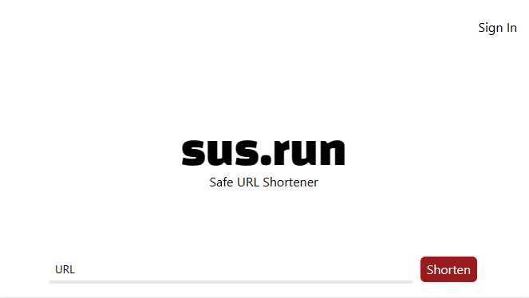

# [sus.run](https://sus.run)

Safe URL Shortener

[](./static/screenshots/)

Created for the [Deno KV hackathon](https://deno.com/blog/deno-kv-hackathon).

Uses [Deno](https://deno.land) and [Fresh](https://fresh.deno.dev).

### Features

- [x] Create short links
- [x] Redirect to original link
- [x] Intercept redirect so user can see where they're going/report any suspicious links
- [x] Show link details, highlight unicode characters
- [x] User auth (github)
- [x] Delete short links
- [x] Basic stats (views, clicks)
- [x] Report as suspicious
- [x] Admin page to view/clear out db
- [x] Add CI/CD (deno deploy)
- [x] Add custom domain ([sus.run](https://sus.run))

TODO:

- [ ] Responsive design
- [ ] Allow users to trust other users (skip landing page for their links)
- [ ] Allow users to report other users
- [ ] Show trust/sus score for user that submitted link
- [ ] Allow users to create vanity links
- [ ] Track stats better to avoid counting bots/same user multiple times
- [ ] Track/show hostnames that are sus
- [ ] Track stats over time
- [ ] Show link trends (clicks/reports/view per day/week/month)
- [ ] Add notes/tags to links
- [ ] Add link expiration
- [ ] Single/X use links
- [ ] Link passwords/restrict to specific users
- [ ] API and docs
- [ ] Add tests

### Running Project

```bash
cp .env.example .env
```

Setup github oauth app and add client id and secret to .env file. Callback should be `http://localhost:8000/oauth/callback/github` for local development.

Start the project:

```bash
deno task start
```

This will watch the project directory and restart as necessary.
